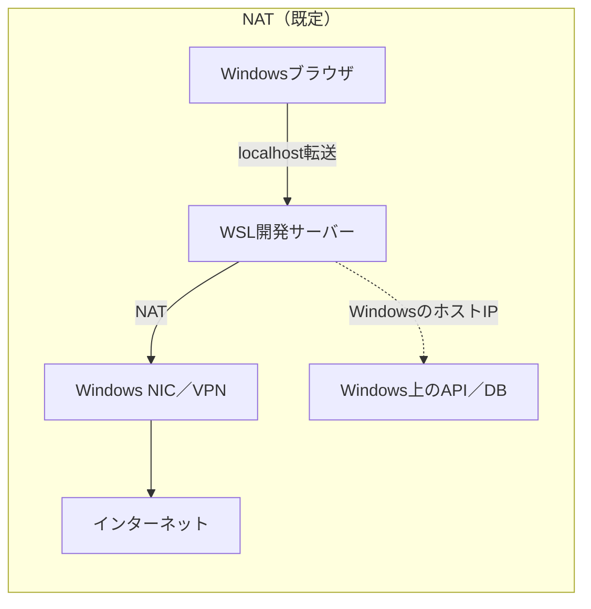
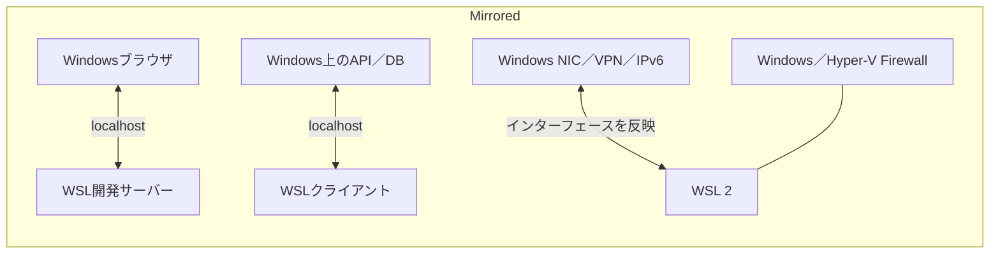
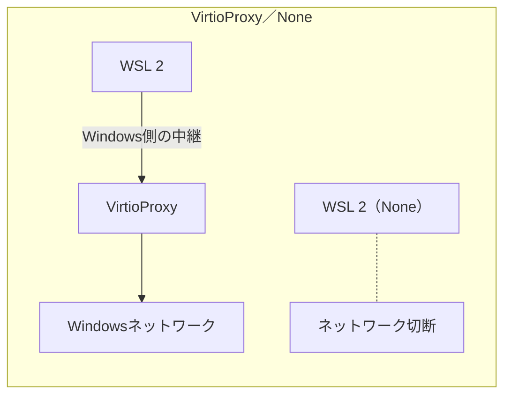

# WSL Project Workbench 製品仮説

- 更新日: 2026-07-30
- 費用方針: 追加費用0円、ローカル実行を既定とする

## 結論

「プロジェクトごとに正しいWindows／WSL環境を選び、必要なシェルと開発ツールを1回で開く」という課題には日常的な利用価値があります。ただし、ターミナルやWSL設定画面をExecLocusが一から作り直すことは勝ち筋ではありません。

Windows TerminalはPowerShellやWSLディストリビューションのプロファイルを自動生成し、`wt.exe`から指定プロファイルを開けます。新しいWSLには公式のWSL Settingsもあり、`.wslconfig`の主要設定をGUIで扱えます。ExecLocusはこれらを置き換えず、**プロジェクト、起動先、権限、診断、開発コマンドを結び付ける作業台**になります。

## 利用者が解決したいこと

- このプロジェクトはPowerShell、コマンドプロンプト、Ubuntuのどれで開くべきか迷う。
- 同じ名前のGit、Node、Codex、Claude Codeが複数あり、起動後の環境が意図と合っているか分からない。
- 管理者シェルが必要な作業と、通常権限で行う開発を混同したくない。
- 複数のWSLディストリビューション、ユーザー、作業ディレクトリを覚えたくない。
- WSLのメモリ、CPU、swapを変更した影響と、反映に必要な再起動を安全に把握したい。
- エラーが起きたとき、環境を探し直さず、その場でDoctorと匿名共有を使いたい。

## MVPの画面

| 画面 | 役割 | MVPで行うこと |
|---|---|---|
| Projects | 日常の入口 | フォルダ、期待OS層、WSLディストリビューション、シェル、通常／管理者、開発コマンドを登録する |
| Launch | 正しい環境を開く | Windows TerminalのPowerShell、CMD、指定WSLプロファイルを正しい作業フォルダで開く |
| Preflight | 起動事故を止める | 実際に選ばれるGit・Node・npm・Codex・Claude Codeを確認し、開始可否を1結論で示す |
| Tasks | 開発を始める | 登録済みのdev、test、buildを選択した環境で起動し、ポートと終了状態を表示する |
| WSL | 状態を把握する | 導入済みディストリビューション、WSLバージョン、停止／実行状態、既定ディストリビューションを読み取り専用で表示する |
| Resources | 設定事故を避ける | 現在のグローバル設定と影響範囲を説明し、公式WSL Settingsを開く。直接編集は後段で検討する |
| Doctor | 問題を解く | 診断シナリオ、実機診断、before／after、匿名共有を1か所へまとめる |

## 既存機能との分担

- **Windows Terminal**: タブ、ペイン、文字描画、シェルプロファイルを担当する。ExecLocusは `wt.exe -p <profile>` などの構造化された引数で起動する。
- **WSL CLI**: `wsl --list --online`、`wsl --install`、`wsl --status`、`wsl --update`、`wsl --shutdown`などの公式操作を担当する。
- **WSL Settings**: `.wslconfig`のGUI編集を担当する。ExecLocusはプロジェクトへの影響、現在値、再起動の必要性を説明して公式画面へ渡す。
- **ExecLocus**: プロジェクトの期待値、実測された実行根拠、起動先、権限、開発タスク、診断履歴を結び付ける。

## 権限と安全設計

| 操作 | 権限・影響 | 製品上の扱い |
|---|---|---|
| 通常のPowerShell／CMD／WSLを開く | 通常権限 | 1クリックで実行可能 |
| 管理者PowerShell／CMDを開く | UAC確認が必要 | 「管理者」バッジを分離し、OSのUACを迂回しない |
| 新しいディストリビューションを表示 | 読み取り専用 | `wsl --list --online`から取得し、一覧をハードコードしない |
| ディストリビューションを導入 | ダウンロード、容量、場合により管理者権限・再起動 | サイズ・操作内容・コマンドを先に示し、明示確認後だけ実行する |
| `.wslconfig`を変更 | 全WSL2ディストリビューションへ影響 | MVPでは現在値と公式Settingsへの導線を提供する |
| `wsl --shutdown` | 全ディストリビューションと実行中処理を停止 | 実行中環境と影響を表示し、明示確認を必須にする |
| `wsl --terminate` | 指定ディストリビューションを停止 | 対象名を表示し、明示確認を必須にする |
| `wsl --unregister` | データを恒久削除 | MVP対象外。通常のGUIには置かない |

`.wslconfig`はWindowsユーザー単位でWSL2全体に作用します。ディストリビューション固有の設定は `/etc/wsl.conf` であり、プロジェクト単位のメモリ割り当てではありません。この違いをGUI上で明記します。

## モード切替は2種類に分ける

「WSLのモード」は混同しやすいため、同じスイッチ画面には置きません。

| 種類 | 対象 | 公式操作 | 影響 |
|---|---|---|---|
| WSL 1／WSL 2 | 1つのディストリビューション | `wsl --set-version <distro> <1\|2>` | ディストリビューションの変換。時間がかかり、失敗する可能性があるため事前バックアップを推奨する |
| WSL 2ネットワークモード | 全WSL 2ディストリビューション | `.wslconfig`の`networkingMode` | WSL 2 VM全体に作用し、反映には通常WSLの停止・再起動が必要になる |

WSL 1／2変換は日常的なトグルとして扱いません。対象、推定サイズ、実行コマンド、バックアップ状況を確認する別ウィザードにします。ネットワークモードは、設定値だけでなく目的と実効状態を示す`Network Mode Advisor`として扱います。

## Network Mode Advisor

### 誰でも分かる選択肢

| モード | 一言で表すと | 主な用途 | 注意 |
|---|---|---|---|
| NAT | WSL 2をWindows内の別ネットワークへ置く | 既定構成、一般的なWeb開発 | WindowsからWSLのサービスは通常localhostで到達できるが、WSLからWindowsのサービスにはホストIPが必要になる場合がある |
| Mirrored | Windowsのネットワーク構成をWSL 2へ反映する | 双方向localhost、VPN、IPv6、multicast、LAN接続 | Windows 11 22H2以降が必要。Hyper-V FirewallやVPNとの組み合わせを確認する |
| VirtioProxy | WSL通信をWindows側のproxy経路で中継する | NATが成立しない構成、互換性の代替経路 | WSLとWindowsのバージョン対応を確認し、変更後の実測を必須にする |
| None | WSL 2のネットワークを切断する | 隔離検証 | パッケージ取得、Git、外部API、Windowsとのネットワーク連携が使えなくなる |
| Bridged | 旧来のブリッジ構成 | 既存環境の表示だけ | WSL 2.4.5以降は非推奨。新規選択肢として勧めない |

### 理解用の簡略図

詳細な内部実装図ではなく、「どの宛先へ、何を経由して届くか」を示します。

### 画面の流れ

1. 「WindowsとWSLでlocalhostを共有したい」「VPNで使いたい」「LANからWSLへ接続したい」「外部通信を止めたい」から目的を選ぶ。
2. 現在のWindows、WSL、`.wslconfig`、Firewall条件で利用可能なモードだけを表示する。
3. モードごとの通信図、できること、使えなくなることを並べる。
4. 変更前後の`.wslconfig`差分と、停止される実行中ディストリビューションを表示する。
5. 「保存だけ」と「保存してWSLを停止」の操作を分離する。
6. 再起動後、ローカルだけで双方向localhost、既定経路、DNS設定、待受ポートを再診断する。
7. 直らなければ、保存した直前の設定へ戻す手順を示す。

インターネットやVPN先への疎通は自動送信しません。必要な場合だけ、利用者が指定した宛先と送信内容を表示して実行します。

## 既存機能・OSSとの重複確認

- 調査日: 2026-07-30
- 範囲: Microsoft公式ドキュメント・公開ソースと、GitHubで確認できた主要WSL GUI候補

| 既存機能 | 確認できた範囲 | ExecLocusで重複させない部分 | 残る差分 |
|---|---|---|---|
| Microsoft WSL Settings | Network mode、Hyper-V Firewall、ignored ports、localhost、loopback、proxy、DNSをGUI設定できる | 生の設定エディター | プロジェクト目的からの選択、通信図、実効状態診断、before／after疎通 |
| [WSLControl](https://github.com/vcprocles/wslcontrol-gui) | WSL 1／2既定値、CPU、RAM、swap、localhost、WSLg等のGUI。公開画面ソースでは`networkingMode`は未確認 | 一般的な`.wslconfig`編集 | プロジェクト連携、ネットワーク図、診断と復元 |
| [WslManager](https://github.com/wslhub/WslManager) | ディストリビューション起動、import／export、コマンド実行、既定ディストリビューション | ディストリビューション管理の再実装 | 正しいプロジェクト環境の起動前診断 |
| [WSL GUI Tool](https://github.com/emeric-martineau/wsl-gui-tool) | start／stop、rename、delete、import／export、環境変数 | 一般的なディストリビューション操作 | 実行根拠、モード適否、ネットワーク再検証 |

主要候補では、モード別の通信経路を初心者向けに図示し、プロジェクトの用途、実測、変更後の再検証まで一体化したものは確認できませんでした。ただし、検索で見つからないことは競合が存在しない証明ではないため、公開前にも再調査します。

## Network Mode Advisorの安全境界

- 既定は読み取り専用で、現在値と有効条件だけを表示する。
- 設定変更前に`.wslconfig`の直前値を復元用としてローカル保存する。
- `wsl --shutdown`は全WSL 2ディストリビューションを停止するため、実行中の対象を表示して明示確認する。
- Firewall変更は管理者権限が必要な別操作とし、ネットワークモード変更へ混ぜない。
- LAN公開、`0.0.0.0`待受、ポート開放はセキュリティ影響を示し、自動適用しない。
- Bridgedは既存値の診断だけに使用し、新しい推奨候補から外す。
- 将来追加されるpreviewモードは、一般WSL向けの公式仕様になるまで通常UIへ出さない。

## 最初に作る縦の流れ

1. プロジェクトフォルダを登録する。
2. 「Windows」「Ubuntu-24.04」など、期待する実行先を選ぶ。
3. Preflightで実測し、「開始してよい／確認が必要／開始しない」を表示する。
4. 問題がなければ、正しいTerminalプロファイルと作業ディレクトリで開く。
5. dev／test／buildを起動する。
6. 失敗したらDoctorを開き、前回との差分と匿名化済み共有情報を作る。

この一連の流れなら、ExecLocusは「たまに開く情報画面」ではなく、開発開始時に毎日使うランチャー兼ガードになります。

## 実装しないもの

- 独自ターミナルエミュレーター
- パスワードや管理者資格情報の保存
- UACの回避
- 未確認のPATH、シェル設定、WSL設定の自動修正
- WSLディストリビューションの無確認削除
- ホスト型AIや有料クラウドを前提とする提案機能

## 無料で構成できる範囲

Tauri、Rust、Windows Terminal、WSL CLI、WSL Settingsをローカルで連携する範囲では、ExecLocus開発による追加利用料は0円です。ディストリビューションのダウンロードには通信量と保存容量が必要ですが、ExecLocusが課金APIを呼ぶことはありません。

## 参考となる公式仕様

- [Windows Terminalの動的プロファイル](https://learn.microsoft.com/en-us/windows/terminal/dynamic-profiles)
- [Windows Terminalのコマンドライン引数](https://learn.microsoft.com/en-us/windows/terminal/command-line-arguments)
- [WSLの基本コマンド](https://learn.microsoft.com/en-us/windows/wsl/basic-commands)
- [WSL 1とWSL 2の比較](https://learn.microsoft.com/en-us/windows/wsl/compare-versions)
- [WSLネットワークアプリへのアクセス](https://learn.microsoft.com/en-us/windows/wsl/networking)
- [WSLの高度な設定（.wslconfigとwsl.conf）](https://learn.microsoft.com/en-us/windows/wsl/wsl-config)
- [MicrosoftによるWSL Settings GUIの紹介](https://devblogs.microsoft.com/commandline/whats-new-in-the-windows-subsystem-for-linux-in-may-2024/)
- [Microsoft WSL Settingsの公開ネットワーク画面](https://github.com/microsoft/WSL/blob/master/src/windows/wslsettings/Views/Settings/NetworkingPage.xaml)
